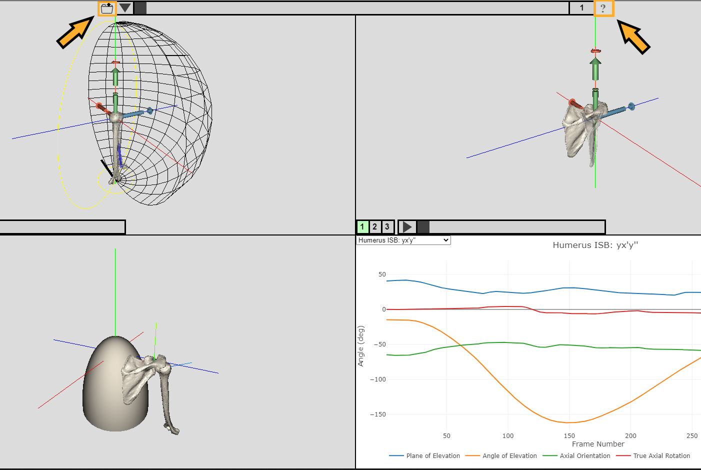

## Kinematics-Vis

This JavaScript application enables biomechanics researchers to visualize and analyze shoulder joint kinematics. It is built on top of [three.js](https://threejs.org/), a JavaScript 3D library. Although presently this application is specialized for analyzing and visualizing the shoulder joint, it should be easy to extend its functionality to other joints.

Kinematics-Vis is currently under review at the [Journal of Open Source Software](https://joss.theoj.org/). You can preview the [in-progress manuscript](https://github.com/klevis-a/kinematics-vis/blob/joos/joos/paper.md), please check back soon for the peer-reviewed publication.

Checkout the [live code demo](https://shouldervis.chpc.utah.edu/kinevis/main.html) currently hosted at the [University of Utah Center for High Performance Computing](https://www.chpc.utah.edu/).

### Installation

This repository depends on [Yarn](https://github.com/yarnpkg/yarn) as a package manager. Please [install Yarn](https://yarnpkg.com/en/docs/install) before proceeding.

##### Clone repository
```
git clone https://github.com/klevis-a/kinematics-vis.git
cd kinematics-vis
```

##### Install dependencies and build

```
yarn install
yarn build
```

##### Download sample dataset

```
yarn fetch_data
```

##### Start `webpack` development server

```
yarn webpack serve
```

##### Access web application

[http://localhost:9000/main.html](http://localhost:9000/main.html)

### Usage
Instructions for interacting with the UI are provided within the web application. Once you access the web app click the question mark that appears at the top of the upper right quadrant. A simple way to provide an input dataset for the web app is to utilize the sample dataset (`yarn fetch_data`). Once the sample dataset has been downloaded, click the folder icon (top of the upper left quadrant), and select a trial to analyze.



### Analyzing your own datasets
To analyze your own data see [INPUT_FILES.md](INPUT_FILES.md) for creating file formats compatible with this web app. To specify your own dataset directory edit the `DATA_DIR` variable within `webpack.config.js`.

### Contributing

See the [CONTRIBUTING](CONTRIBUTING.md) document for details on contributing to the project by reporting a bug, submitting a fix, or proposing new features.